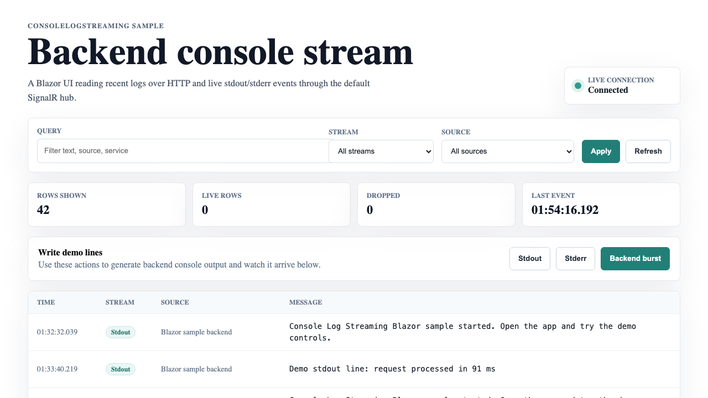
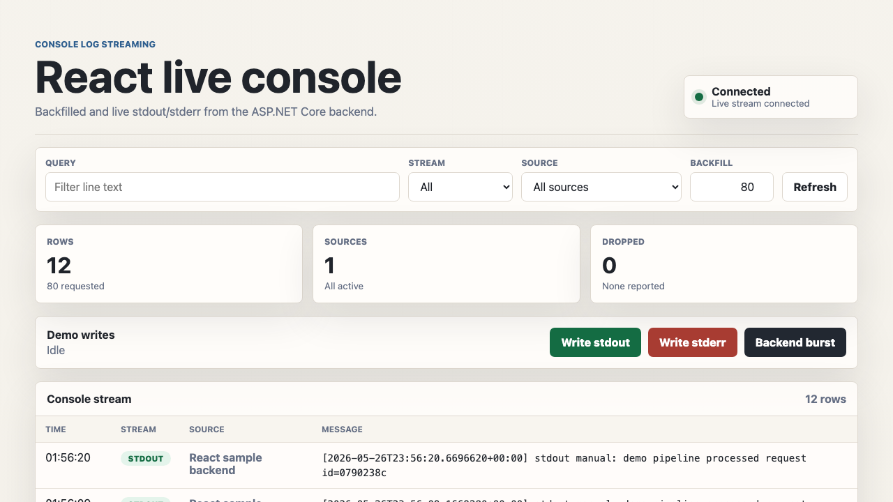
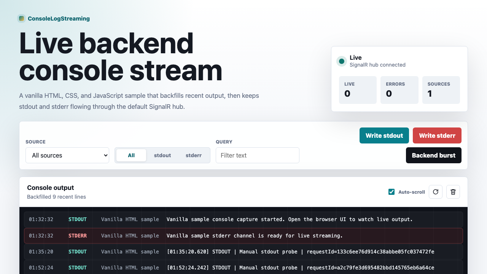

# Console Log Streaming

Console Log Streaming is a small .NET library family for capturing managed
`Console.Out` and `Console.Error` output as redacted, line-oriented diagnostics
events. It gives applications a reusable foundation for recent console log
backfill, live streaming, and optional short-term SQLite persistence without
coupling the core package to ASP.NET Core, SignalR, SQLite, Elsa, or any one UI.

## Why

Many .NET apps need an admin-facing view of raw backend console output: worker
progress, boot diagnostics, library `Console.WriteLine` calls, stderr messages,
and troubleshooting traces that are not always represented as structured
`ILogger` events.

The usual choices are awkward:

- SSH into the host or inspect container logs.
- Build a one-off `Console.SetOut` wrapper per app.
- Force everything through a logging framework and lose raw stdout/stderr
  semantics.
- Add a vendor log stack when all you need is short-term operational visibility.

Console Log Streaming packages the reusable middle layer: safe managed capture,
redaction, bounded buffers, filters, live subscriptions, optional web transport,
and optional local persistence.

## Packages

| Package | Purpose |
|---------|---------|
| `ConsoleLogStreaming.Core` | Framework-neutral capture, redaction, models, bounded in-memory provider, and async live subscriptions. |
| `ConsoleLogStreaming.Contracts` | Shared HTTP and realtime DTOs plus core-to-DTO mapping seams. |
| `ConsoleLogStreaming.Endpoints.MinimalApi` | Minimal API recent and sources endpoints. |
| `ConsoleLogStreaming.Endpoints.FastEndpoints` | FastEndpoints recent and sources endpoints. |
| `ConsoleLogStreaming.SignalR` | Optional SignalR realtime hub and subscription manager. |
| `ConsoleLogStreaming.AspNetCore` | Convenience package that composes Minimal API endpoints and SignalR. |
| `ConsoleLogStreaming.Persistence.Sqlite` | Optional durable store for redacted console lines with retention. |

## Safety Model

Console output often contains sensitive data. The library is designed around a
strict boundary:

1. Managed stdout/stderr writes are captured by a tee writer.
2. Lines are normalized, optionally stripped of ANSI escapes, and redacted.
3. Only redacted line events reach providers, live subscribers, web endpoints,
   SignalR clients, or SQLite persistence.

Default redaction masks common bearer tokens, password/secret/token/API-key style
values, cookies, authorization values, and connection string style values. Add
your own rules for application-specific secrets.

## Important Limitations

Version 1 captures managed .NET `Console.Out` and `Console.Error` writes. It does
not guarantee capture of:

- Native code writing directly to stdout/stderr file descriptors.
- Libraries that cached `Console.Out` or `Console.Error` before capture started.
- Output emitted by child processes unless the child output is redirected back
  into the current process and written to managed console writers.

Use platform/container logs for authoritative process-level log capture. Use this
library for reusable in-app diagnostics surfaces.

## Core Usage

```csharp
using ConsoleLogStreaming.Core;
using ConsoleLogStreaming.Core.DependencyInjection;
using ConsoleLogStreaming.Core.Models;
using Microsoft.Extensions.DependencyInjection;

await using var services = new ServiceCollection()
    .AddConsoleLogStreaming(options =>
    {
        options.SourceId = "worker-1";
        options.RecentCapacity = 1000;
        options.MaxLineLength = 16 * 1024;
        options.RedactionRules.Add(new()
        {
            Name = "Tenant token",
            Pattern = @"tenant-token=[^\s]+",
            Replacement = "tenant-token=[redacted]"
        });
    })
    .BuildServiceProvider();

var capture = services.GetRequiredService<IConsoleLogCapture>();
await capture.StartAsync();

Console.WriteLine("Hello from stdout");
Console.Error.WriteLine("Hello from stderr");

var provider = services.GetRequiredService<IConsoleLogProvider>();
var recent = await provider.GetRecentAsync(new ConsoleLogFilter
{
    Stream = ConsoleStream.Stdout,
    Limit = 50
});

var sources = services.GetRequiredService<IConsoleLogSourceRegistry>();
sources.SourceChanged += source =>
{
    // Notify clients when sources appear or move between connected/stale states.
};

await capture.StopAsync();
```

For app hosts that want managed process-wide capture tied to `IHostedService`,
use the host registration. It exposes the same host-owned provider, source
registry, redaction pipeline, formatter, and capture service through DI:

```csharp
builder.Services.AddConsoleLogStreamingHost(options =>
{
    options.ServiceName = "orders-worker";
    options.RecentCapacity = 5000;
});
```

Register `IConsoleLogMetadataAccessor` before `AddConsoleLogStreamingHost` to add
per-line metadata. Register a custom `IConsoleLogProvider` before it when you
want the process-wide host to write to your own backend.

For advanced hosts that need to build their own line formatter or metadata
adapter, the core package also exposes the raw process-wide hook:

```csharp
using ConsoleLogStreaming.Core.Capture;

ConsoleStreamHook.Install();

using var subscription = ConsoleStreamHook.Subscribe(chunk =>
{
    ConsoleStreamHook.SuppressCapture = true;
    try
    {
        // Forward chunk.Text to your own buffer, provider, or transport here.
    }
    finally
    {
        ConsoleStreamHook.SuppressCapture = false;
    }
});
```

## ASP.NET Core Usage

```csharp
using ConsoleLogStreaming.AspNetCore.DependencyInjection;
using ConsoleLogStreaming.Core.DependencyInjection;

var builder = WebApplication.CreateBuilder(args);

builder.Services.AddConsoleLogStreaming(options =>
{
    options.ServiceName = "orders-api";
});

builder.Services.AddConsoleLogStreamingAspNetCore(options =>
{
    options.AuthorizationPolicy = "diagnostics.console";
    options.RecentPath = "/diagnostics/console-logs/recent";
    options.SourcesPath = "/diagnostics/console-logs/sources";
    options.HubPath = "/hubs/console-logs";
});

var app = builder.Build();
app.MapConsoleLogStreaming();

await app.Services.GetRequiredService<IConsoleLogCapture>().StartAsync();
await app.RunAsync();
```

Endpoints:

- `POST /diagnostics/console-logs/recent`
- `GET /diagnostics/console-logs/sources`
- SignalR hub: `/hubs/console-logs`

The hub exposes a streaming method:

```csharp
var channel = await connection.StreamAsChannelAsync<ConsoleLogStreamingItem>(
    "StreamAsync",
    new ConsoleLogFilter { Query = "startup", Limit = 100 });
```

It also supports push-style methods:

- `SubscribeAsync(ConsoleLogFilter filter)`
- `UpdateFilterAsync(ConsoleLogFilter filter)`
- `UnsubscribeAsync()`

## SQLite Persistence

SQLite persistence is optional and intended for short-term troubleshooting, not
compliance audit logging.

```csharp
using ConsoleLogStreaming.Persistence.Sqlite.DependencyInjection;

builder.Services.AddConsoleLogStreaming();
builder.Services.AddConsoleLogStreamingSqlite(options =>
{
    options.ConnectionString = "Data Source=console-logs.db";
    options.MaxAge = TimeSpan.FromDays(7);
    options.MaxRows = 100_000;
});
```

SQLite stores redacted line text and redacted source metadata only. Writes are
queued and batched so console writes do not wait on disk I/O. Configure retention
for production use.

## Filtering

Recent queries and live subscriptions use `ConsoleLogFilter`:

- `SourceId`
- `Stream`
- `Query`
- `From`
- `To`
- `Limit`
- `Metadata`

Providers clamp requested limits to configured maximums.

## Build

```sh
dotnet build ConsoleLogStreaming.slnx
dotnet test ConsoleLogStreaming.slnx
```

## Samples

The repository includes three runnable UI samples that all use the same backend
console streaming surface. Each sample starts its own ASP.NET Core host,
captures managed stdout/stderr, persists redacted lines to a local SQLite
database, backfills recent output, and streams live events through SignalR.

| Sample | Best for | Project |
|--------|----------|---------|
| Blazor Server | A fully .NET diagnostics surface with Razor components and server-side interactivity. | `samples/ConsoleLogStreaming.Sample.Blazor` |
| React | A static React frontend served by ASP.NET Core without requiring an npm install. | `samples/ConsoleLogStreaming.Sample.React` |
| Vanilla HTML + JavaScript | The smallest browser integration using plain HTML, CSS, JavaScript, and the SignalR client. | `samples/ConsoleLogStreaming.Sample.Vanilla` |

### Blazor Server



The Blazor sample uses interactive server components for the dashboard and
regular ASP.NET Core endpoints for the console stream API. It is useful when you
want the diagnostics UI to live inside an existing .NET admin app without adding
a separate frontend toolchain.

```sh
dotnet run --project samples/ConsoleLogStreaming.Sample.Blazor
```

### React



The React sample serves prebuilt static assets from `wwwroot` and connects to
the same SignalR hub from the browser. It demonstrates how a JavaScript frontend
can consume recent backfill, source metadata, and live stdout/stderr updates from
the shared ASP.NET Core package.

```sh
dotnet run --project samples/ConsoleLogStreaming.Sample.React
```

### Vanilla HTML + JavaScript



The vanilla sample keeps the browser side intentionally small: static HTML,
CSS, and JavaScript call the diagnostics endpoints directly and subscribe to the
SignalR stream. Use it as the clearest reference for integrating the API without
a framework.

```sh
dotnet run --project samples/ConsoleLogStreaming.Sample.Vanilla
```

All three UI samples expose the same runtime behavior:

- recent console line backfill on load and after filter changes
- live stdout/stderr streaming through SignalR
- connected/stale source status
- query and stream filtering
- demo write buttons for stdout, stderr, and mixed bursts

They also map the same backend routes:

- `GET /diagnostics/console-logs/recent?limit=100`
- `GET /diagnostics/console-logs/sources`
- SignalR hub at `/hubs/console-logs`
- demo write endpoints under `/demo/*`

For more sample notes, see [`samples/README.md`](samples/README.md). The
screenshot gallery is also available at
[`docs/sample-screenshots.md`](docs/sample-screenshots.md).

To build all sample projects:

```sh
dotnet build samples/ConsoleLogStreaming.Sample.Blazor
dotnet build samples/ConsoleLogStreaming.Sample.React
dotnet build samples/ConsoleLogStreaming.Sample.Vanilla
```

## Package Publishing

The base package version is controlled by `VersionPrefix` in
`Directory.Build.props`.

GitHub Actions publishes packages from `.github/workflows/nuget.yml`:

- Pushes to `main` publish preview packages using
  `{VersionPrefix}-preview.{GITHUB_RUN_NUMBER}`.
- Manual `workflow_dispatch` runs publish preview packages using the same
  preview version format when run from `main`. Dispatches from other branches
  build, test, pack, and upload artifacts without publishing to NuGet.org.
- Published GitHub releases publish stable packages using `VersionPrefix`.
- Release tags must match the `VersionPrefix` in `Directory.Build.props`, e.g.
  `1.2.3` or `v1.2.3`.

Configure the repository secret `NUGET_API_KEY` with a NuGet.org API key before
publishing. If the secret is not configured, the workflow still builds, tests,
packs, and uploads artifacts, but skips the NuGet.org publish step.

## Repository Layout

```text
src/
├── ConsoleLogStreaming.Core/
├── ConsoleLogStreaming.AspNetCore/
└── ConsoleLogStreaming.Persistence.Sqlite/

test/
└── ConsoleLogStreaming.Tests/

samples/
├── ConsoleLogStreaming.Sample.AspNetCore/
├── ConsoleLogStreaming.Sample.Blazor/
├── ConsoleLogStreaming.Sample.React/
└── ConsoleLogStreaming.Sample.Vanilla/
```

## License

MIT.
